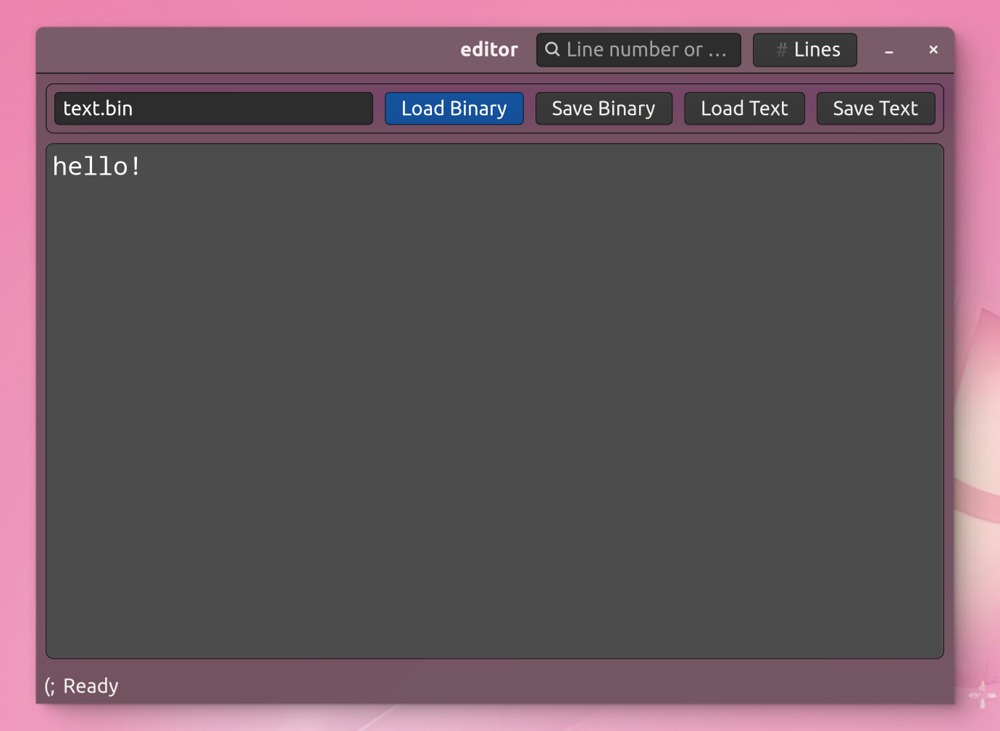

# GTK4 Text Editor on Binary Tree

[](LICENSE) 
[](https://www.gtk.org)
[](https://cmake.org)

**Текстовый редактор с внутренним представлением текста в виде бинарного дерева**



## Описание

Это учебный проект, демонстрирующий применение сложных структур данных в реальном приложении. В отличие от традиционных текстовых редакторов, где текст хранится в виде простого массива строк, данное приложение использует **бинарное дерево** для внутреннего представления редактируемого текста.

Дерево сериализуется в **собственный бинарный формат файла**, позволяя эффективно работать с большими объемами данных при минимальных затратах памяти. Проект реализован с использованием современного C++ и графической библиотеки GTK4.

## Ключевые особенности

- **Бинарное дерево в качестве основной структуры данных**:
  - Листовые узлы содержат строки длины без нуль-терминатора
  - Внутренние узлы хранят кэшированную статистику поддеревьев
- **Кастомный бинарный формат файла**:
  - Заголовок с сигнатурой "TREE" и версией формата
  - Сериализация с использованием смещений узлов (offset-based)
- **Графический интерфейс на GTK4**:
  - Интуитивно понятное окно редактирования
  - Поддержка кириллицы и любых UTF-8 символов
- **Эффективная работа с памятью**:
  - Ручное управление памятью вместо стандартных контейнеров
  - Тестирование производительности на файлах до 500 КБ
  - Потребление памяти не превышает 150 МБ даже при работе с большими файлами

## Требования

- GTK4 development libraries
- CMake версии 3.10 или новее
- Компилятор C++17 (GCC или Clang)
- Опционально: Nix для воспроизводимого окружения

## 🚀 Сборка и запуск

### С использованием CMake (стандартный способ)

```bash
# Клонирование репозитория
git clone https://github.com/trash2bin/GTK4-text-editer-on-binary-tree.git
cd GTK4-text-editer-on-binary-tree

# Сборка проекта
make

# Запуск приложения
./build/src/editor
```

### С использованием Nix (рекомендуется для полной воспроизводимости)

```bash
nix develop  # Активация окружения разработки
make
./build/src/editor
```

## Структура проекта

```
├── CMakeLists.txt          # Главный файл сборки CMake
├── compile_commands.json   # Конфигурация для IDE
├── flake.lock              # Блокировка версий Nix
├── flake.nix               # Определение окружения Nix
├── Makefile                # Удобная обертка для сборки
├── docs/                   # Описание и скриншоты по проекту
├── src/                    # Исходный код приложения
│   ├── CMakeLists.txt
│   ├── BinaryTreeFile.cpp  # Работа с бинарными файлами
│   ├── BinaryTreeFile.h
│   ├── CustomTextView.cpp  # Кастомный текстовый виджет
│   ├── CustomTextView.h
│   ├── EditorWindow.cpp    # Главное окно редактора
│   ├── EditorWindow.h
│   ├── main.cpp            # Точка входа
│   ├── Tree.cpp            # Реализация бинарного дерева
│   └── Tree.h
└── tests/                  # Тесты приложения
    ├── CMakeLists.txt
    ├── gen_file.cpp        # Генератор тестовых файлов
    ├── test1.cpp           # Тест структуры дерева
    ├── test2.cpp           # Тест бинарного формата
    └── test-gtk.cpp        # Тест GTK компонентов
```

## Тестирование

```bash
cd build
make
./build/tests/tree_tests    # Тесты для структуры дерева
./build/tests/file_tests    # Тесты для бинарного формата
./build/tests/gtk_tests     # Тесты графического интерфейса
```

Также доступен скрипт для генерации тестовых файлов большого размера:

```bash
./build/tests/gen_test_file 500000 test_500kb.txt  # Генерация файла размером 500 КБ
```

## Алгоритмы и технические детали

### Формат бинарного файла

```
[ ЗАГОЛОВОК (16 байт)        ]
[ magic (4) + версия (4) + смещение корня (8) ]
[ ... тело файла ...         ]
[ узлы в порядке post-order  ]
```

### Структура дерева

- **LeafNode**:
  - `int length` - длина строки в байтах
  - `int lineCount` - количество строк
  - `char* data` - указатель на сырые данные без '\0'

- **InternalNode**:
  - `Node* left` - левый потомок
  - `Node* right` - правый потомок
  - `int totalLength` - общая длина поддерева
  - `int totalLineCount` - общее количество строк в поддереве

### Алгоритм создания дерева из текста



1. Разделение текста на строки по символу `\n`
2. Рекурсивное построение сбалансированного дерева:
   - Максимальный размер листа: 4096 байт
   - Приоритет разделения по границам строк
   - В случае отсутствия границ - разделение по середине

## 📚 Курсовая работа

Этот проект был выполнен в рамках курсовой работы по дисциплине *Объектно-ориентированное программирование* в Брянском государственном техническом университете (2025 г.).

📄 **Полный текст работы доступен здесь**: [Kyrsovay.pdf](docs/Kyrsovay.pdf)

### Основные разделы
- **Анализ предметной области**: сравнение подходов к хранению текста (массив строк, связный список, rope, бинарное дерево).
- **Конструкторская часть**: описание структуры проекта, алгоритма сериализации и формата бинарного файла.
- **Технические решения**:
  - Бинарное дерево с листами переменной длины (без `\0`)
  - Кастомный класс `BinaryTreeFile`, наследующий `std::fstream`
  - Сериализация через смещения (offset-based) в little-endian
- **Тестирование**: проверка корректности работы с файлами до 500 КБ, кириллицей, GTK4-интерфейсом.
- **Итоги и перспективы развития**

## Лицензия

Проект распространяется под лицензией MIT. Подробности см. в файле [LICENSE](LICENSE).

---

**Примечание:** Это учебный проект, созданный в рамках курсовой работы по дисциплине объектно-ориентированного программирования. Проект демонстрирует принципы работы со сложными структурами данных, сериализацией и ручным управлением памятью в C++ при создании графических приложений.
